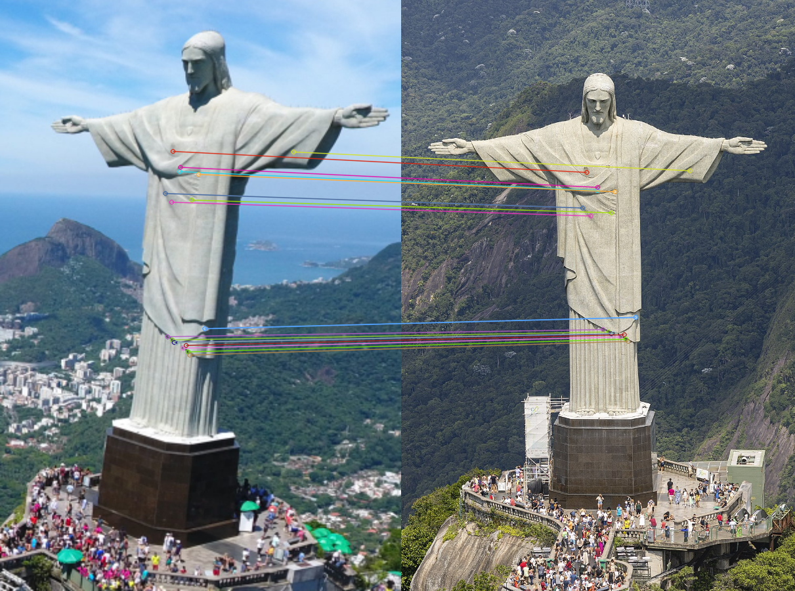

# 🧠 Projeto N3 - Correspondência de Pontos de Interesse em Imagens

Este projeto realiza a detecção e correspondência de pontos de interesse entre **duas imagens do mesmo local**, verificando se se tratam realmente de visões diferentes do mesmo cenário.

O algoritmo utiliza técnicas de Visão Computacional para detectar pontos, comparar descritores e filtrar correspondências confiáveis, indicando visualmente os pontos que são equivalentes nas duas imagens.

---

## 🖼️ Exemplo de Resultado

Correspondência de pontos na estátua do Cristo Redentor:



---

## 🚀 Tecnologias Utilizadas

| Tecnologia | Uso |
|-----------|-----|
| **Python** | Lógica do projeto |
| **OpenCV** | Extração de descritores, matching e visualização |
| **SIFT** | Detector/descritor robusto para texturas |
| **AKAZE** | Detector complementar em superfícies lisas |
| **FLANN Matcher** | Comparação eficiente dos descritores |
| **RANSAC + Homografia** | Filtragem de outliers e validação geométrica |

---

## 🔍 Como o sistema funciona?

1️⃣ Detecção de pontos de interesse nas duas imagens  
2️⃣ Extração de descritores (características únicas de cada ponto)  
3️⃣ Matching entre os descritores de cada imagem  
4️⃣ Teste de Lowe para remover correspondências fracas  
5️⃣ **RANSAC** para eliminar pontos que não obedecem à geometria do objeto  
6️⃣ Geração de uma imagem final com linhas ligando os pontos equivalentes  
7️⃣ Decisão final sobre serem do mesmo local ou não

---

## ▶ Como executar

### 📌 1. Instalar dependências

```bash
pip install opencv-python opencv-contrib-python numpy
📌 2. Colocar as imagens no mesmo diretório
Renomeie como:

Copiar código
imagem1.png
imagem2.png
📌 3. Rodar o programa
bash
Copiar código
python comparar_imagens.py
A saída será:

imagem resultado_match.png mostrando os matches filtrados

mensagem indicando se são do mesmo local

📊 Critérios de Decisão
O sistema considera que as imagens representam o mesmo cenário se:

✔ Possuírem mínimo de 18 inliers
✔ Passarem no teste geométrico por Homografia

Isso garante alta precisão e confiabilidade.

📎 Estrutura do Projeto
bash
Copiar código
📁 N3-MARTIM
 ├── 📄 comparar_imagens.py   # Código principal
 ├── 🖼 imagem1.png            # Primeira imagem
 ├── 🖼 imagem2.png            # Segunda imagem
 └── 🖼 resultado_match.png    # Resultado com correspondências
🧠 Autor
Inácio Tomazelli

📌 Observações Finais
✔ Pontos falsos no fundo são eliminados automaticamente
✔ Visual limpo e profissional
✔ Projeto validado com imagens reais do Cristo Redentor

🎯 Objetivo Avaliado
Demonstrar a aplicação prática de técnicas de Visão Computacional para
análise e correspondência de imagens, incluindo detecção de interesse,
matching, validação geométrica e interpretação dos resultados.
